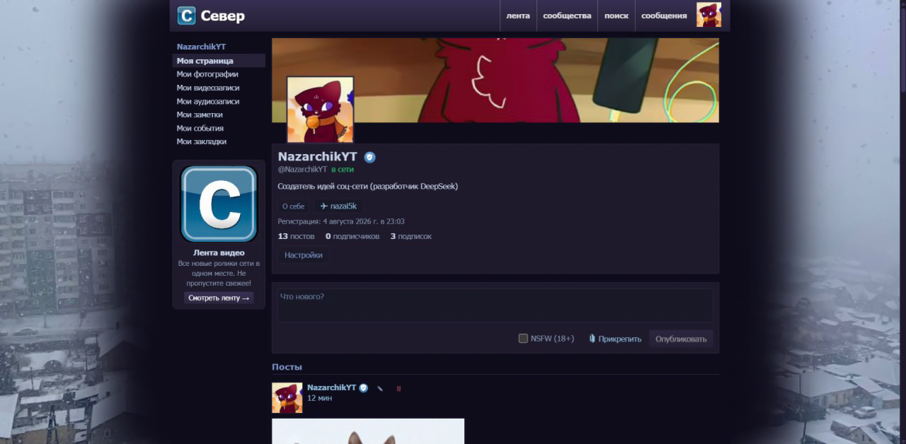

**An experimental social network created entirely by a neural network (DeepSeek V4 Flash)**

## About the Project

Sever is an attempt to build a social network-one that happened almost by accident.

The project was written **not by a human**, but by the aforementioned neural network, under my guidance-using prompts, option selection, and testing. I DID NOT WRITE ANY CODE, AND I AM NOT A PROGRAMMER!

The goal was to see if it is possible to write a functional social network entirely using a neural network, starting with nothing but the project idea.

## DO NOT USE THIS AS A REAL, PRODUCTION SOCIAL NETWORK!!!

Although the project includes some user security features (such as 2FA), security vulnerabilities cannot be ruled out.

**A public launch is not recommended, and the code is not intended for production use.**

The project is **archived from the start** and WILL NOT BE UPDATED.

(The deploy folder contains files for running it on a Debian server.)

## The Tech Stack:

**React (Vite)** · **Node/Express** · **SQLite** · **WebSocket** · **2FA (TOTP)**

> Creator of the artwork for the avatar and profile banner: "Bruce Bronze"

**_ENGLISH AI TRANSLATION OF README_**

